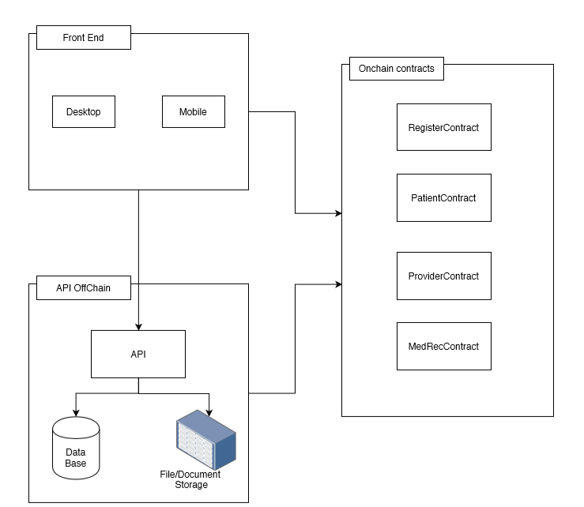

# ml-medrec-solution-poc-1

This is a POC (proof of concept) for a general framework for storing, sharing and managing medical records leveraging Ethereum blockchain. This POC is available on the Morpheus Labs SEED for platform users to learn / use / test a simple dApp to register / share medical dianose records securely leveraging blockchain.

The initial version, the offchain components of the framework is implemented using NodeJs.

We will create a open source based framework based on this POC and the Baseline protocol and the community developers can implement and extend the framework based on specific needs.

# System outline
System includes 3 main modules

1. Frontend for user, clinice, provider, authenticated viewers to view data
2. Smart contracts on eth blockchain
3. Offchain data services to save detail information, all information saved onchain is merkle root of bunch information



# Prerequirements

1. NodeJs v10+
2. npm v 6.14.4+
3. Ganache v2.0+
4. truffle v5.1.23+

# Installing

1. Clone code `git clone https://github.com/Morpheuslabs-io/ml-medrec-solution-poc1`
2. Run `cd ml-medrec-solution-poc1`
3. Run `npm install`
4. Run `truffle migrate --reset`
5. Get MedRecProxyContract Address after deployment and update to `PROXY_ADDRESS` in `src/config/dev.js`
6. Get privateKey in ganache account to update to `MASTER_ETH_ACCOUNT` in `src/config/dev.js`, don't forget to add `0x` before privateKey
7. Start application `npm start`
8. Test API

Note: default admin account: admin/admin

# Run on dev environment

## 1. Start ganache and deploy contracts 
Goto project folder and run `truffle migrate --reset`

## 2. Update config
Get smart contract address and update to field `PROXY_ADDRESS` in `dev.js` file
Get private key of deployed address and update to field `MASTER_ETH_ACCOUNT` in `dev.js` file

## 3. Start app 
Run `npm start` 

## 4. Register as provider

Goto: `http://localhost:3000/api-docs/#/user/register` and fill in body request

Request Example:

```
{
  "username": "clinic2",
  "password": "passw@rd",
  "firstName": "Micheal",
  "lastName": "Phelps",
  "type" : "Provider",
  "email": "micheal.phelps@gmail.com",
  "phone": "202-555-0180",
  "identification": "S3749204C",
  "description": "Clinic Mega at HongKong street"
}
```

Response

```
{
  "code": 200,
  "msg": "OK",
  "data": {
    "msg": "Your registration is submited, please wait for approval"
  }
}
```

## 5. Login as admin
Goto: http://localhost:3000/api-docs/#/user/loginUser

Request body example:

```
{
  "username": "admin",
  "password": "admin"
}
```

Response:

```
{
  "code": 200,
  "msg": "OK",
  "data": {
    "token": "ZXlKaGJHY2lPaUpJVXpJMU5pSjkuZXlKMWMyVnlibUZ0WlNJNkltRmtiV2x1SWl3aWRIbHdaU0k2SWtGa2JXbHVJaXdpYldWeWEyeGxVbTl2ZENJNklqSXpOemhrTnpZeU1tVXhOREF3T1dNeVlqYzRaamN5WkROaU1qTXdOemt4TVdabE5HRmhaakl4TjJNMVlXUmxPR016TlRaallXRmpZbUptT0RCaVltUWlmUS45akxpZXZyMjJNUkp0TWVldTVUdmlPbHlmMENGMHA5VlB0Tm5JVzlIc3pV"
  }
}
```

## 6. View list pending provider

Goto: http://localhost:3000/api-docs/#/admin/getProviders
- Select status = 0
- Fill token to login as `Bearer {token}`
- And execute to get provider


Response:

```
{
  "code": 200,
  "msg": "OK",
  "data": [
    {
      "id": "5edf60565a534900b28ad037",
      "username": "clinic1",
      "firstName": "Micheal",
      "lastName": "Phelps",
      "type": "Provider",
      "email": "micheal.phelps@gmail.com",
      "phone": "202-555-0180",
      "status": 0,
      "ethAddress": "0x1dA004641fcB4c6f4309F209685a3709AedBF60c",
      "description": "Clinic Mega at HongKong street"
    }
  ]
}
```

## 7. Approve provider
Goto: http://localhost:3000/api-docs/#/admin/approveUser

Request example:
```
{
  "username": "clinic1"
}
```

Reponse
```
{
  "code": 200,
  "msg": "OK",
  "data": {
    "msg": "Provider is approved"
  }
}
```
## 8. Login as provider
Goto: http://localhost:3000/api-docs/#/user/loginUser

Request body example:

```
{
  "username": "clinic1",
  "password": "passw@rd"
}
```

Response:

```
{
  "code": 200,
  "msg": "OK",
  "data": {
    "token": "ZXlKaGJHY2lPaUpJVXpJMU5pSjkuZXlKMWMyVnlibUZ0WlNJNkltTnNhVzVwWXpFaUxDSmxkR2hCWkdSeVpYTnpJam9pTUhneFpFRXdNRFEyTkRGbVkwSTBZelptTkRNd09VWXlNRGsyT0RWaE16Y3dPVUZsWkVKR05qQmpJaXdpZEhsd1pTSTZJbEJ5YjNacFpHVnlJaXdpYldWeWEyeGxVbTl2ZENJNkltWmtNR1kzWmpjMU5UbG1PRGt5WVRnMFpqaG1PR0UyT1RFM09UZzNOR0ZpTnpkbFpXTm1aamt4T1dZek5EUTJOV1psTXpZd1ltVmhOVEpoTTJNeE5HVWlmUS5ZcXc2V1Jobkg4VXd3UWxDOE4xUnVORXZVb1dadjIwQjdSOGY2VUU0V2tV"
  }
}
```

## 9. Add new Patient

Goto: http://localhost:3000/api-docs/#/medrec/addPatient
- Login as provider

Request example:

```
{
  "username": "tushen",
  "password": "tushen",
  "firstName": "Tu",
  "lastName": "Shen",
  "email": "rimos45664@lerwfv.com",
  "phone": "65-855-5597-8",
  "identification": "S6822328H",
  "address":"Ang Mo Kio (AMK) Tech 1 3 Ang Mo Kio Industrial Park 2a #04-14 568050, Singapore",
  "description": "Tu Shen"
}
```

Response:

```
{
  "code": 200,
  "msg": "OK",
  "data": {
    "message": "Patient is created",
    "user": {
      "username": "tushen",
      "firstName": "Tu",
      "lastName": "Shen",
      "type": "Patient",
      "email": "rimos45664@lerwfv.com",
      "phone": "65-855-5597-8",
      "identification": "S6822328H",
      "ethAddress": "0x2511C4601b1F21A5813E7e5Ec44eC4A8e2D2B178",
      "description": "Tu Shen",
      "status": 1,
      "merkleRoot": "24adadedda5a464adc320a24ace276ea4f8758b0bf9ad2eb4b18676a51870b22",
      "__v": 0
    },
    "txHash": "0x82b367d3ef07b67a0b4b21e3e7adb63e073e5be407065dad63270bb07879e18d"
  }
}
```

## 10. Add diagnose for patient

Adding medical diagnose for patient

Goto:http://localhost:3000/api-docs/#/medrec/addDiagnose
- Login as provider
- get value of `ethAddress` in response after adding new patient to add diagnose test for him

Request example:

```
{
	"patientAddress": "0x2511C4601b1F21A5813E7e5Ec44eC4A8e2D2B178",
	"time": 1590305489,
	"name": "COVID 19 Testing",
	"note": "Checking COVID 19"
}
```

Response:

```
{
  "code": 200,
  "msg": "OK",
  "data": {
    "message": "Diagnose is added",
    "diagnose": {
      "_id": "5ee0366feb1cf9016eefd8ab",
      "diagnoseCode": "6138c92d-8cd1-4bc3-9bad-27c8fb59fa85",
      "providerAddress": "0x1dA004641fcB4c6f4309F209685a3709AedBF60c",
      "patientAddress": "0x2511C4601b1F21A5813E7e5Ec44eC4A8e2D2B178",
      "name": "COVID 19 Testing",
      "time": "1970-01-19T09:45:05.489Z",
      "note": "Checking COVID 19",
      "merkleRoot": "0x41f7c8457812d9f77931d80856fe7eca09728d5a10e67544d723e9b97a4e2d18",
      "__v": 0
    },
    "txHash": "0x5cd1911dc86e7f6bfda2c5b1d214c38bf646d10bf84e8c6599906e95051933fd"
  }
}
```

## 11. Add Covid test as dignose detail for patient

Add Covid test result for patient

Goto: http://localhost:3000/api-docs/#/medrec/addDiagnoseResult
- Login as provider
- Add diagnose test result to blockchain

Request example: 

```
{ 
	"diagnoseMerkleRoot":"0x41f7c8457812d9f77931d80856fe7eca09728d5a10e67544d723e9b97a4e2d18", 
	"patientAddress":"0x2511C4601b1F21A5813E7e5Ec44eC4A8e2D2B178", 
	"time":1590305489, 
	"rt_qpcr": 1, 
	"igm": 1, 
	"igg": 0, 
	"note":"Covid Test result for Tu Shen"
}
```

Response:

```
{
  "code": 200,
  "msg": "OK",
  "data": {
    "message": "DiagnoseTest is saved",
    "diagoseTest": {
      "_id": "5ee0464b4c9dba0194605b8e",
      "diagnoseMerkleRoot": "0x41f7c8457812d9f77931d80856fe7eca09728d5a10e67544d723e9b97a4e2d18",
      "providerAddress": "0x1dA004641fcB4c6f4309F209685a3709AedBF60c",
      "patientAddress": "0x2511C4601b1F21A5813E7e5Ec44eC4A8e2D2B178",
      "rt_qpcr": 1,
      "igm": 1,
      "igg": 0,
      "note": "Covid Test result for Tu Shen",
      "merkleRoot": "0x7304baeb3a61330956b5c263c9a3441e2ab3173079e55ea49ed91564d53660b2",
      "__v": 0
    },
    "txHash": "0xba3a2ee67f8a310236a9b62464453bd7f0f6b03a5b843862622ccdbfb40ca53f"
  }
}
```

## 12. Register as AuthInstitue

Goto: http://localhost:3000/api-docs/#/user/register
- Login as admin
- Submit register request

Request example:

```
{
  "username": "authechecker1",
  "password": "passw@rd",
  "firstName": "Hua",
  "lastName": "Dong",
  "type" : "AuthViewer",
  "email": "nocopof587@nedrk.com",
  "phone": "+65-855-5682-3",
  "identification": "S8560274H",
  "description": "Changi Airport checker"
}
```

Response

```
{
  "code": 200,
  "msg": "OK",
  "data": {
    "msg": "Your registration is submited, please wait for approval"
  }
}
```
## 14. Get List Authviewer and approve (need login as admin)

Goto: http://localhost:3000/api-docs/#/admin/getInstitute
- Login as admin
- Get list authenticated institutes

Response:

```
{
  "code": 200,
  "msg": "OK",
  "data": [
    {
      "id": "5ee047af4c9dba0194605b8f",
      "username": "authechecker1",
      "firstName": "Hua",
      "lastName": "Dong",
      "type": "AuthViewer",
      "email": "nocopof587@nedrk.com",
      "phone": "+65-855-5682-3",
      "ethAddress": "0x4DF70046E15D38F95D2f13fbc231c63DeCA06596",
      "description": "Changi Airport checker"
    }
  ]
}
```

Goto: http://localhost:3000/api-docs/#/admin/approveUser

- Approve for authenticated institute to able to view date on blockchain

Request example:
```
{
  "username": "authechecker1"
}
```

Reponse
```
{
  "code": 200,
  "msg": "OK",
  "data": {
    "msg": "User is approved"
  }
}
```

## 13. View diagnose of patient for verification

Goto: http://localhost:3000/api-docs/#/medrec/getDiagnose
- Login as provider or Authenticated institute

Response:
```
{
  "code": 200,
  "msg": "OK",
  "data": [
    {
      "_id": "5ee04b5b27dfe601fa0286d1",
      "diagnoseCode": "7870ec46-07de-470c-a640-9a62344eb415",
      "providerAddress": "0xb757CE16A7dA1722D6c86a4c218F9cb070acBd35",
      "patientAddress": "0xFBD1a4D947d7B2E0201b8Ca429f134324bEF0DF0",
      "name": "COVID 19 Testing",
      "time": "1970-01-19T09:45:05.489Z",
      "note": "Checking COVID 19",
      "merkleRoot": "0x9917dce6b0e16aee916088bacc685bcdb94cbf3ee91899f57a18140ef7b03c28",
      "__v": 0
    }
  ]
}
```

## 13. View detail information of diagnose of patient

Goto: http://localhost:3000/api-docs/#/medrec/getDiagnoseResult
- Login as provider or Authenticated institute

Response:
```
{
  "code": 200,
  "msg": "OK",
  "data": {
    "_id": "5ee04b9b27dfe601fa0286d2",
    "diagnoseMerkleRoot": "0x9917dce6b0e16aee916088bacc685bcdb94cbf3ee91899f57a18140ef7b03c28",
    "providerAddress": "0xb757CE16A7dA1722D6c86a4c218F9cb070acBd35",
    "patientAddress": "0xFBD1a4D947d7B2E0201b8Ca429f134324bEF0DF0",
    "rt_qpcr": 1,
    "igm": 1,
    "igg": 0,
    "note": "Covid Test result for Tu Shen",
    "merkleRoot": "0xb2cb8abe454b4e7393c4019e67f91a1f77b2e86553656192c367d6132b04dc0d",
    "__v": 0
  }
}
```


